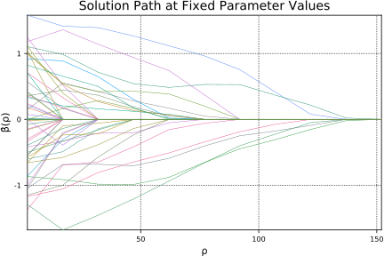

# Optimize at fixed tuning parameter value(s)

`lsq_constrsparsereg.jl` fits constrained lasso

$$\begin{split}
& \text{minimize} \hspace{1em} \frac{1}{2}||\boldsymbol{y}-\boldsymbol{X\beta}||^2_2 + \rho||\beta||_1 \\
& \text{ subject to} \hspace{0.5em} \boldsymbol{A\beta}=\boldsymbol{b} \text{ and } \boldsymbol{C\beta} \leq \boldsymbol{d}
\end{split}$$

at a fixed tuning parameter value $\rho$ or several tuning parameter values provided by user.

### Single tuning parameter value

We demonstrate the usage of a single tuning parameter value with a sum-to-zero constraint example defined as 

$$\begin{split}
& \text{minimize} \hspace{1em} \frac{1}{2}||\boldsymbol{y}-\boldsymbol{X\beta}||^2_2 + \rho||\beta||_1 \\
& \text{ subject to} \hspace{0.5em} \sum_j \beta_j = 0.
\end{split}$$

First, let's define a true parameter `β` such that `sum(β) = 0`.


```julia
using ConstrainedLasso, Base.Test
```


```julia
n, p = 50, 100  
β = zeros(p)
β[1:round(Int, p / 4)] = 0
β[(round(Int, p / 4) + 1):round(Int, p / 2)] = 1
β[(round(Int, p / 2) + 1):round(Int, 3p / 4)] = 0
β[(round(Int, 3p / 4) + 1):p] = -1
β
```


    100-element Array{Float64,1}:
      0.0
      0.0
      0.0
      0.0
      0.0
      0.0
      0.0
      0.0
      0.0
      0.0
      0.0
      0.0
      0.0
      ⋮  
     -1.0
     -1.0
     -1.0
     -1.0
     -1.0
     -1.0
     -1.0
     -1.0
     -1.0
     -1.0
     -1.0
     -1.0


Next we generate data based on the true parameter `β`.


```julia
srand(41)
X = randn(n, p)
```


    50×100 Array{Float64,2}:
      1.21212    -0.153889    0.141533  …  -0.458125    0.0951976  -2.14019   
      0.345895    1.30676     1.60944      -0.409901    0.323719    0.989333  
     -1.27859    -1.18894     0.512064      1.80509     1.62606    -1.44251   
      0.230616    2.54741    -0.523533      2.73358     1.07999     0.432834  
     -1.17103    -0.39082     0.441921     -0.179239   -0.158189   -0.640611  
      1.67135     0.0829011   0.964089  …  -0.720038    1.99359    -0.671572  
     -0.614717    2.16204    -0.0602       -0.324456   -0.616887    1.11243   
     -0.810535    0.974719   -0.045405      0.881578    1.29611     0.696869  
     -1.10879    -1.32489    -1.18272       0.579381   -0.971269   -0.687591  
     -0.219752   -0.447897   -0.974186     -0.880804   -0.480702   -1.36887   
      0.0952544  -0.126203   -0.273737  …  -0.264421    0.565684   -0.798719  
      1.4126      0.295896   -0.213161     -1.46343    -1.27144    -0.0589753 
     -0.418407   -0.479389    0.324243      1.96976     0.867659   -1.2999    
      ⋮                                 ⋱                                     
      0.504861   -1.03911    -0.357771      0.815027    0.919037    1.07463   
     -0.820358   -0.955319    0.097768      0.553219    1.56424     0.10535   
      1.39684     1.93183     0.706641  …  -0.0222014   0.987281   -0.0646814 
     -1.55206     0.446778    1.48206      -1.42384    -1.04209     0.0460478 
      0.928527    0.933087   -0.641975     -1.16347    -0.313851   -1.20434   
      0.380879   -0.144713    1.54374      -0.605637    0.408246    0.632131  
     -1.30233    -2.31664     1.51324       0.765034   -0.515553    0.984551  
      1.36747     1.34059    -0.114778  …   0.846682   -0.565511   -0.539113  
     -2.82496    -0.0447351   0.426242     -0.353497   -0.14583    -0.00304009
     -0.847741    1.49306     1.15522       0.637659    1.70818     0.641035  
     -0.22286    -0.43932    -0.373259      0.788337    0.223785   -0.343495  
      1.32145     0.104516   -0.993017     -0.272744   -0.133748    0.968627  


```julia
y = X * β + randn(n)
```


    50-element Array{Float64,1}:
      -9.90585 
      -5.40562 
       5.24289 
      -6.29951 
      -4.9586  
      -6.1342  
      -7.90981 
       2.51009 
      -5.79548 
       1.61355 
      -0.722766
      10.4522  
       4.03935 
       ⋮       
       0.397781
      -2.6661  
       5.36896 
      -3.56537 
      -2.402   
       0.11478 
      -5.39248 
       4.38391 
       0.706801
     -10.1066  
      -1.12558 
      14.2473  


Since the equality constraint can be written as 

$$\begin{split}
\begin{pmatrix} 1 & 1 & \cdots & 1 \end{pmatrix} \beta = 0,
\end{split}$$

we define the constraint as below.


```julia
beq   = 0.0
Aeq   = ones(1, p)
```


    1×100 Array{Float64,2}:
     1.0  1.0  1.0  1.0  1.0  1.0  1.0  1.0  …  1.0  1.0  1.0  1.0  1.0  1.0  1.0


Now we are ready to fit the constrained lasso problem, say at `ρ=10`.


```julia
ρ = 10.0
β̂, = lsq_constrsparsereg(X, y, ρ; Aeq = Aeq, beq = beq);
```


```julia
β̂
```


    100×1 Array{Float64,2}:
      0.0332021  
      3.10012e-10
     -4.6978e-10 
     -0.39502    
     -2.56803e-10
     -5.22472e-11
     -5.31822e-10
     -4.24518e-11
      0.288476   
     -6.96174e-10
     -1.18309e-10
     -4.8233e-11 
     -6.46568e-11
      ⋮          
     -0.188338   
     -2.37826e-9 
     -1.60819e-9 
      1.41678e-10
     -0.84392    
     -0.645577   
     -0.257303   
     -1.43023e-10
     -1.13316    
      4.26293e-10
     -3.84653e-10
      2.17566e-9 


We see if the sum of estimated $\beta$ coefficients is approximately equal to 0.


```julia
@test sum(β̂)≈0.0 atol=1e-6
```


    Test Passed
    


### Multiple tuning parameter values

Define `ρlist` to be a decreasing sequence of values from 152.0 to 2.0.


```julia
ρlist = 152.0:-15.0:2.0
```


    152.0:-15.0:2.0


Using the same equality constraints, we fit the constrained lasso.


```julia
β̂, = lsq_constrsparsereg(X, y, ρlist; Aeq = Aeq, beq = beq);
```


```julia
β̂
```


    100×11 Array{Float64,2}:
      5.7885e-8    9.72387e-9    2.81065e-10  …   2.48441e-8    1.51451e-8 
     -5.87852e-8  -1.31342e-8   -3.79759e-10     -4.08278e-10   0.178717   
     -3.38004e-8  -7.55024e-9   -2.09421e-10     -5.52919e-9   -1.02944e-9 
     -8.00996e-8  -1.8626e-8    -6.07662e-10     -0.330981     -0.414043   
     -1.46534e-7  -4.13375e-8   -1.40985e-9      -5.87274e-9   -3.33221e-10
      1.35681e-7   2.5494e-8     8.8654e-10   …   1.77541e-9   -4.14188e-10
     -7.15503e-8  -1.62251e-8   -4.70464e-10     -9.09917e-9    3.28018e-11
     -3.43517e-8  -7.81034e-9   -2.37254e-10     -1.42302e-9    8.38037e-11
      9.96051e-8   1.79582e-8    6.78349e-10      0.205806      0.335375   
     -9.85721e-9  -2.84963e-9   -6.60348e-11     -4.06107e-9   -0.157908   
     -5.23226e-8  -1.19088e-8   -3.45603e-10  …  -5.93287e-10  -2.44739e-9 
      7.14349e-9   4.03781e-10  -2.60167e-11     -4.83948e-10  -8.79003e-10
     -1.71432e-8  -4.23818e-9   -1.15154e-10     -3.84297e-10  -8.17787e-10
      ⋮                                       ⋱                 ⋮          
     -4.47748e-8  -9.81256e-9   -2.58362e-10     -0.137195     -0.391635   
     -1.48721e-8  -3.93589e-9   -1.06969e-10     -6.58309e-9   -0.33352    
     -2.15687e-8  -5.18704e-9   -1.69607e-10  …  -1.82448e-8   -5.51459e-9 
     -1.74035e-8  -4.39562e-9   -1.63827e-10      2.06069e-9    1.09637e-9 
     -4.3585e-7   -0.0198435    -0.152322        -0.914601     -0.867639   
     -1.40812e-7  -3.82869e-8   -1.1339e-9       -0.218698     -0.999583   
     -7.48206e-8  -1.72154e-8   -4.88002e-10     -0.237392     -0.577743   
     -3.60962e-8  -8.21917e-9   -2.17684e-10  …  -8.88674e-10  -8.93601e-10
     -2.73163e-7  -1.44347e-7   -1.31485e-8      -1.05679      -1.16862    
      2.52674e-8   3.8825e-9     1.33482e-10      1.82138e-9    2.29367e-9 
     -4.49981e-8  -9.74654e-9   -2.59147e-10     -6.95863e-9   -1.52035e-9 
      4.50404e-8   7.3066e-9     2.16334e-10      1.6277e-8     2.71896e-9 


```julia
using Plots; pyplot();
plot(ρlist, β̂', label="", xaxis = ("ρ", (minimum(ρlist),
      maximum(ρlist))), yaxis = ("β̂(ρ)"), width=0.5) 
title!("Solution Path at Fixed Parameter Values") 
```


```julia
savefig("misc/fixed.svg")
```

<a name="figparam"></a>


*Follow the [link](https://github.com/Hua-Zhou/ConstrainedLasso.jl/blob/master/docs/src/demo/fixedparam.ipynb) to access the .ipynb file of this page.*
