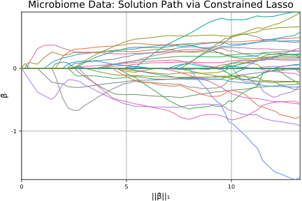

# Microbiome Data


   This real data application uses microbiome data [[7](../references.md#7)]. The dataset itself contains information on 160 bacteria genera from 37 patients. The bacteria counts were $\log_2$-transformed and normalized to have a constant average across samples.

First, let's load and organize data.


```julia
zerosum = readcsv("misc/zerosum.csv", header=true)[1]
y = zerosum[:, 1]
```


    37-element Array{Float64,1}:
       3.1158 
       3.21448
     -11.1341 
      -5.13988
      -4.8247 
      -4.79219
     -11.5719 
      -5.77868
       4.97972
      -3.38806
      -9.90973
       3.07384
       2.77814
       ⋮      
      -7.41032
       4.70871
       1.49355
       3.93736
      -3.29476
     -10.9239 
     -11.021  
       3.18789
      -8.73771
     -11.499  
       3.66284
      -8.88277


```julia
X = zerosum[:, 2:end]
```


    37×160 Array{Float64,2}:
     0.0  3.32193  0.0  1.0      10.5304   …  0.0      0.0  0.0  0.0  12.513  
     0.0  4.08746  0.0  0.0       7.35755     0.0      0.0  0.0  0.0   0.0    
     0.0  0.0      0.0  0.0       0.0         0.0      0.0  0.0  0.0   0.0    
     0.0  3.32193  0.0  0.0       0.0         0.0      0.0  0.0  0.0   0.0    
     0.0  1.0      0.0  0.0       0.0         0.0      0.0  0.0  0.0   1.0    
     0.0  3.16993  0.0  0.0       0.0      …  0.0      0.0  0.0  0.0   0.0    
     0.0  0.0      0.0  0.0       1.0         1.58496  0.0  0.0  0.0   0.0    
     0.0  0.0      0.0  0.0       0.0         0.0      0.0  0.0  0.0   0.0    
     0.0  0.0      0.0  0.0       4.64386     0.0      0.0  0.0  0.0   1.58496
     0.0  1.0      0.0  0.0       0.0         0.0      0.0  0.0  1.0   0.0    
     0.0  0.0      0.0  0.0       0.0      …  0.0      0.0  0.0  0.0   1.0    
     0.0  5.45943  0.0  0.0       3.90689     0.0      0.0  0.0  0.0   1.58496
     0.0  4.70044  0.0  0.0       0.0         0.0      0.0  0.0  0.0   0.0    
     ⋮                                     ⋱  ⋮                               
     0.0  0.0      0.0  0.0       0.0      …  0.0      0.0  0.0  0.0   0.0    
     0.0  3.58496  0.0  0.0      12.2886      0.0      0.0  0.0  0.0   7.39232
     0.0  4.80735  0.0  6.87036   8.01123     0.0      0.0  0.0  0.0   3.0    
     0.0  0.0      0.0  0.0       5.93074     0.0      0.0  0.0  0.0   0.0    
     0.0  7.7211   0.0  0.0       1.0         0.0      0.0  0.0  0.0   0.0    
     0.0  0.0      0.0  0.0       0.0      …  0.0      0.0  0.0  0.0   0.0    
     0.0  0.0      1.0  0.0       1.0         0.0      0.0  0.0  0.0   0.0    
     0.0  4.08746  0.0  0.0       3.0         0.0      0.0  0.0  0.0   0.0    
     0.0  0.0      0.0  0.0       0.0         0.0      0.0  0.0  0.0   0.0    
     0.0  0.0      0.0  0.0       0.0         0.0      0.0  0.0  0.0   1.0    
     0.0  5.04439  0.0  0.0       0.0      …  0.0      0.0  0.0  0.0  10.444  
     0.0  0.0      0.0  0.0       0.0         0.0      0.0  0.0  0.0   0.0    


[Altenbuchinger et al.](../references.md#1) demonstrated that a sum-to-zero constraint is useful anytime the normalization of data relative to some reference point results in proportional data, as is often the case in biological applications, since the analysis using the constraint is insensitive to the choice of the reference. [Altenbuchinger et al.](../references.md#1) derived a coordinate descent algorithm for the elastic net with a zero-sum constraint, 

```math
\begin{split}
& \text{minimize} \hspace{1em} \frac 12||\boldsymbol{y}-\boldsymbol{X\beta}||^2_2 + \rho\Big(||\boldsymbol{\beta}||_1 + \frac{1-\alpha}{2}||\boldsymbol{\beta}||_2^2\Big) \\
& \text{subject to} \hspace{1em} \sum_j \beta_j = 0
\end{split}
```

but the focus of their analysis corresponds to ``\alpha = 1``. Hence the problem is reduced to the constrained lasso.

We set up the zero-sum constraint.


```julia
n, p = size(X)
Aeq = ones(1, p)
beq = [0]
m1 = size(Aeq, 1);
```

Now we estimate the constrained lasso solution path using path algorithm.


```julia
using ConstrainedLasso
using ECOS
solver = ECOSSolver(verbose=0, maxit=1e8);
β̂path, ρpath, = lsq_classopath(X, y; Aeq = Aeq, beq = beq, solver = solver)
```


```julia
β̂path
```


    160×79 Array{Float64,2}:
     0.0  0.0  0.0  0.0  0.0  0.0  0.0  0.0  …   0.0        0.0        0.0      
     0.0  0.0  0.0  0.0  0.0  0.0  0.0  0.0      0.484646   0.488903   0.490802 
     0.0  0.0  0.0  0.0  0.0  0.0  0.0  0.0     -0.209662  -0.248845  -0.253282 
     0.0  0.0  0.0  0.0  0.0  0.0  0.0  0.0      0.0        0.0        0.0      
     0.0  0.0  0.0  0.0  0.0  0.0  0.0  0.0      0.0        0.0        0.0      
     0.0  0.0  0.0  0.0  0.0  0.0  0.0  0.0  …   0.0        0.0        0.0      
     0.0  0.0  0.0  0.0  0.0  0.0  0.0  0.0      0.0        0.0        0.0      
     0.0  0.0  0.0  0.0  0.0  0.0  0.0  0.0      0.0        0.0        0.0      
     0.0  0.0  0.0  0.0  0.0  0.0  0.0  0.0      0.897273   0.888551   0.889344 
     0.0  0.0  0.0  0.0  0.0  0.0  0.0  0.0      0.0        0.0        0.0      
     0.0  0.0  0.0  0.0  0.0  0.0  0.0  0.0  …   0.0        0.0        0.0      
     0.0  0.0  0.0  0.0  0.0  0.0  0.0  0.0      0.0        0.0        0.0      
     0.0  0.0  0.0  0.0  0.0  0.0  0.0  0.0      0.0        0.0        0.0      
     ⋮                        ⋮              ⋱                                  
     0.0  0.0  0.0  0.0  0.0  0.0  0.0  0.0      0.0        0.0        0.0      
     0.0  0.0  0.0  0.0  0.0  0.0  0.0  0.0      0.0        0.0        0.0      
     0.0  0.0  0.0  0.0  0.0  0.0  0.0  0.0  …   0.0        0.0        0.0      
     0.0  0.0  0.0  0.0  0.0  0.0  0.0  0.0      0.0        0.0        0.0      
     0.0  0.0  0.0  0.0  0.0  0.0  0.0  0.0      0.0        0.0        0.0      
     0.0  0.0  0.0  0.0  0.0  0.0  0.0  0.0      0.0        0.0        0.0      
     0.0  0.0  0.0  0.0  0.0  0.0  0.0  0.0      0.0        0.0       -0.0220978
     0.0  0.0  0.0  0.0  0.0  0.0  0.0  0.0  …   0.0        0.0        0.0      
     0.0  0.0  0.0  0.0  0.0  0.0  0.0  0.0      0.0        0.0        0.0      
     0.0  0.0  0.0  0.0  0.0  0.0  0.0  0.0      0.0        0.0        0.0      
     0.0  0.0  0.0  0.0  0.0  0.0  0.0  0.0      0.0        0.0        0.0      
     0.0  0.0  0.0  0.0  0.0  0.0  0.0  0.0      0.659693   0.659783   0.658592 


Then we calculate `L1` norm of coefficients at each $\rho$.


```julia
norm1path = zeros(size(β̂path, 2))
for i in eachindex(norm1path)
    norm1path[i] = norm(β̂path[:, i], 1)
end
norm1path
```


    79-element Array{Float64,1}:
      0.0     
      0.0     
      0.1462  
      0.236204
      0.368326
      0.75722 
      1.08009 
      1.43022 
      1.45122 
      1.6103  
      1.95359 
      1.9595  
      1.96205 
      ⋮       
     11.2506  
     11.5025  
     11.8854  
     11.9934  
     12.0591  
     12.2261  
     12.2836  
     12.7327  
     12.9722  
     13.0533  
     13.221   
     13.2708  


Now, let's plot the solution path, $\widehat{\boldsymbol{\beta}}(\rho)$, as a function of $||\widehat{\boldsymbol{\beta}}(\rho)||_1$ using constrained lasso.


```julia
using Plots; pyplot();
plot(norm1path, β̂path', xaxis = ("||β̂||₁"), yaxis=("β̂"), label="")
title!("Microbiome Data: Solution Path via Constrained Lasso")
```

