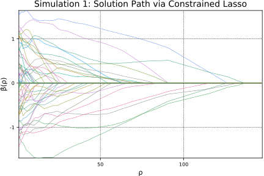
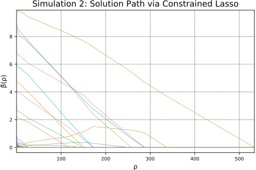

# Path algorithm  


## Sum-to-zero constraint 

In this example, we will solve a problem defined by 

```math 
\begin{split}
& \text{minimize} \hspace{1em} \frac 12||\boldsymbol{y}-\boldsymbol{X\beta}||^2_2 + \rho||\boldsymbol{\beta}||_1  \\
& \text{subject to} \hspace{1em} \sum_j \beta_j = 0
\end{split}
```
Note that we can re-write the constraint as 
$\boldsymbol{A\beta} = \boldsymbol{b}$

where 

```math
\boldsymbol{A} = \begin{pmatrix} 1 & 1 & \cdots & 1 \end{pmatrix} \text{ and } \boldsymbol{b} = 0.
```

First let's generate the predictor matrix `X` and response vector `y`. To do so, we need a true parameter vector `β` whose sum equals to 0. Note `n` is the number of observations `n` and `p` is the number of predictors. 

```julia
n, p = 50, 100  
β = zeros(p)
β[1:round(Int, p / 4)] = 0
β[(round(Int, p / 4) + 1):round(Int, p / 2)] = 1
β[(round(Int, p / 2) + 1):round(Int, 3p / 4)] = 0
β[(round(Int, 3p / 4) + 1):p] = -1
srand(41)
X = randn(n, p)
```


    50×100 Array{Float64,2}:
      1.21212    -0.153889    0.141533  …  -0.458125    0.0951976  -2.14019   
      0.345895    1.30676     1.60944      -0.409901    0.323719    0.989333  
     -1.27859    -1.18894     0.512064      1.80509     1.62606    -1.44251   
      0.230616    2.54741    -0.523533      2.73358     1.07999     0.432834  
     -1.17103    -0.39082     0.441921     -0.179239   -0.158189   -0.640611  
      1.67135     0.0829011   0.964089  …  -0.720038    1.99359    -0.671572  
     -0.614717    2.16204    -0.0602       -0.324456   -0.616887    1.11243   
     -0.810535    0.974719   -0.045405      0.881578    1.29611     0.696869  
     -1.10879    -1.32489    -1.18272       0.579381   -0.971269   -0.687591  
     -0.219752   -0.447897   -0.974186     -0.880804   -0.480702   -1.36887   
      0.0952544  -0.126203   -0.273737  …  -0.264421    0.565684   -0.798719  
      1.4126      0.295896   -0.213161     -1.46343    -1.27144    -0.0589753 
     -0.418407   -0.479389    0.324243      1.96976     0.867659   -1.2999    
      ⋮                                 ⋱                                     
      0.504861   -1.03911    -0.357771      0.815027    0.919037    1.07463   
     -0.820358   -0.955319    0.097768      0.553219    1.56424     0.10535   
      1.39684     1.93183     0.706641  …  -0.0222014   0.987281   -0.0646814 
     -1.55206     0.446778    1.48206      -1.42384    -1.04209     0.0460478 
      0.928527    0.933087   -0.641975     -1.16347    -0.313851   -1.20434   
      0.380879   -0.144713    1.54374      -0.605637    0.408246    0.632131  
     -1.30233    -2.31664     1.51324       0.765034   -0.515553    0.984551  
      1.36747     1.34059    -0.114778  …   0.846682   -0.565511   -0.539113  
     -2.82496    -0.0447351   0.426242     -0.353497   -0.14583    -0.00304009
     -0.847741    1.49306     1.15522       0.637659    1.70818     0.641035  
     -0.22286    -0.43932    -0.373259      0.788337    0.223785   -0.343495  
      1.32145     0.104516   -0.993017     -0.272744   -0.133748    0.968627  


```julia
y = X * β + randn(n)
```


    50-element Array{Float64,1}:
      -9.90585 
      -5.40562 
       5.24289 
      -6.29951 
      -4.9586  
      -6.1342  
      -7.90981 
       2.51009 
      -5.79548 
       1.61355 
      -0.722766
      10.4522  
       4.03935 
       ⋮       
       0.397781
      -2.6661  
       5.36896 
      -3.56537 
      -2.402   
       0.11478 
      -5.39248 
       4.38391 
       0.706801
     -10.1066  
      -1.12558 
      14.2473  


Since the problem has equality constraints only, we define the constraints as below. 

```julia
beq = [0]
Aeq = ones(1, p)
```


    1×100 Array{Float64,2}:
     1.0  1.0  1.0  1.0  1.0  1.0  1.0  1.0  …  1.0  1.0  1.0  1.0  1.0  1.0  1.0


```julia
using ConstrainedLasso
β̂path1, ρpath1, objpath, = lsq_classopath(X, y; Aeq = Aeq, beq = beq);
```

Now we are ready to obtain the solution path using the path algorithm. By default, we use the solver SCS. 

```julia
β̂path1
```


    100×64 Array{Float64,2}:
     0.0  0.0   0.0         0.0       …   0.0        0.0        0.0     
     0.0  0.0   0.0         0.0           0.206561   0.212696   0.22402 
     0.0  0.0   0.0         0.0           0.0        0.0        0.0     
     0.0  0.0   0.0         0.0          -0.378352  -0.411385  -0.41288 
     0.0  0.0   0.0         0.0           0.0        0.0        0.0     
     0.0  0.0   0.0         0.0       …   0.0        0.0        0.0     
     0.0  0.0   0.0         0.0           0.0        0.0        0.0     
     0.0  0.0   0.0         0.0           0.0        0.0        0.0     
     0.0  0.0   0.0         0.0           0.325283   0.3467     0.357212
     0.0  0.0   0.0         0.0          -0.19861   -0.181371  -0.181397
     0.0  0.0   0.0         0.0       …   0.0        0.0        0.0     
     0.0  0.0   0.0         0.0           0.0        0.0        0.0     
     0.0  0.0   0.0         0.0           0.0        0.0        0.0     
     ⋮                                ⋱                                 
     0.0  0.0   0.0         0.0          -0.46258   -0.452943  -0.458164
     0.0  0.0   0.0         0.0          -0.401578  -0.359423  -0.358849
     0.0  0.0   0.0         0.0       …   0.0        0.0        0.0     
     0.0  0.0   0.0         0.0           0.0        0.0        0.0     
     0.0  0.0  -0.0558231  -0.101399     -0.850614  -0.874227  -0.881474
     0.0  0.0   0.0         0.0          -1.07203   -1.05001   -1.06761 
     0.0  0.0   0.0         0.0          -0.674324  -0.621432  -0.622139
     0.0  0.0   0.0         0.0       …   0.0        0.0        0.0     
     0.0  0.0   0.0         0.0          -1.25239   -1.20357   -1.2081  
     0.0  0.0   0.0         0.0           0.0        0.0        0.0     
     0.0  0.0   0.0         0.0           0.0        0.0        0.0     
     0.0  0.0   0.0         0.0           0.0        0.0        0.0     


Let's see if sums of coefficients at all ``\rho`` values are approximately 0. 

```julia
all(abs.(sum(β̂path1, 1)) .< 1e-6)
```


    true


We plot the solution path below. 

```julia
using Plots; pyplot();
plot(ρpath1, β̂path1', label="", xaxis = ("ρ", (minimum(ρpath1),
      maximum(ρpath1))), yaxis = ("β̂(ρ)"), width=0.5) 
title!("Simulation 1: Solution Path via Constrained Lasso") 
```



## Non-negativity constraint 

In this example, the problem is defined by 

```math 
\begin{split}
& \text{minimize} \hspace{1em} \frac 12||\boldsymbol{y}-\boldsymbol{X\beta}||^2_2 + \rho||\boldsymbol{\beta}||_1  \\
& \text{subject to} \hspace{1em} \beta_j \geq 0 \forall j
\end{split}
```

We can re-write the inequality constraint as
$\boldsymbol{C\beta} \leq \boldsymbol{d}$ where 

```math
\boldsymbol{C} = \begin{pmatrix} 
-1 & & & \\
	& -1 & & \\
	&   & \ddots & \\
	& 	& 	& -1
\end{pmatrix}
\text{ and } \boldsymbol{d} = \begin{pmatrix} 0 \\ 0 \\ \vdots \\ 0 \end{pmatrix}
```

First we define a true parameter vector `β` that is sparse with a few non-zero coefficients. Let `n` and `p` be the number of observations and predictors, respectively. 


```julia
n, p = 50, 100   
β = zeros(p)
β[1:10] = 1:10
srand(41)
X = randn(n, p)
```


    50×100 Array{Float64,2}:
      1.21212    -0.153889    0.141533  …  -0.458125    0.0951976  -2.14019   
      0.345895    1.30676     1.60944      -0.409901    0.323719    0.989333  
     -1.27859    -1.18894     0.512064      1.80509     1.62606    -1.44251   
      0.230616    2.54741    -0.523533      2.73358     1.07999     0.432834  
     -1.17103    -0.39082     0.441921     -0.179239   -0.158189   -0.640611  
      1.67135     0.0829011   0.964089  …  -0.720038    1.99359    -0.671572  
     -0.614717    2.16204    -0.0602       -0.324456   -0.616887    1.11243   
     -0.810535    0.974719   -0.045405      0.881578    1.29611     0.696869  
     -1.10879    -1.32489    -1.18272       0.579381   -0.971269   -0.687591  
     -0.219752   -0.447897   -0.974186     -0.880804   -0.480702   -1.36887   
      0.0952544  -0.126203   -0.273737  …  -0.264421    0.565684   -0.798719  
      1.4126      0.295896   -0.213161     -1.46343    -1.27144    -0.0589753 
     -0.418407   -0.479389    0.324243      1.96976     0.867659   -1.2999    
      ⋮                                 ⋱                                     
      0.504861   -1.03911    -0.357771      0.815027    0.919037    1.07463   
     -0.820358   -0.955319    0.097768      0.553219    1.56424     0.10535   
      1.39684     1.93183     0.706641  …  -0.0222014   0.987281   -0.0646814 
     -1.55206     0.446778    1.48206      -1.42384    -1.04209     0.0460478 
      0.928527    0.933087   -0.641975     -1.16347    -0.313851   -1.20434   
      0.380879   -0.144713    1.54374      -0.605637    0.408246    0.632131  
     -1.30233    -2.31664     1.51324       0.765034   -0.515553    0.984551  
      1.36747     1.34059    -0.114778  …   0.846682   -0.565511   -0.539113  
     -2.82496    -0.0447351   0.426242     -0.353497   -0.14583    -0.00304009
     -0.847741    1.49306     1.15522       0.637659    1.70818     0.641035  
     -0.22286    -0.43932    -0.373259      0.788337    0.223785   -0.343495  
      1.32145     0.104516   -0.993017     -0.272744   -0.133748    0.968627  


```julia
y = X * β + randn(n)
```


    50-element Array{Float64,1}:
      12.6173  
      40.3776  
       2.2169  
      27.4631  
      38.592   
       7.82023 
      22.7367  
       7.88475 
      -7.47037 
       0.621035
      -4.91899 
     -14.9363  
       8.26901 
       ⋮       
       7.83882 
      -9.30699 
     -29.7205  
      15.2482  
     -19.1784  
      14.9865  
       2.32728 
      -9.11988 
     -15.3472  
      22.9679  
      -0.997964
      42.6068  


Now set up the inequality constraint for the problem.

```julia
bineq = zeros(p)
Aineq = - eye(p)
```


    100×100 Array{Float64,2}:
     -1.0  -0.0  -0.0  -0.0  -0.0  -0.0  …  -0.0  -0.0  -0.0  -0.0  -0.0  -0.0
     -0.0  -1.0  -0.0  -0.0  -0.0  -0.0     -0.0  -0.0  -0.0  -0.0  -0.0  -0.0
     -0.0  -0.0  -1.0  -0.0  -0.0  -0.0     -0.0  -0.0  -0.0  -0.0  -0.0  -0.0
     -0.0  -0.0  -0.0  -1.0  -0.0  -0.0     -0.0  -0.0  -0.0  -0.0  -0.0  -0.0
     -0.0  -0.0  -0.0  -0.0  -1.0  -0.0     -0.0  -0.0  -0.0  -0.0  -0.0  -0.0
     -0.0  -0.0  -0.0  -0.0  -0.0  -1.0  …  -0.0  -0.0  -0.0  -0.0  -0.0  -0.0
     -0.0  -0.0  -0.0  -0.0  -0.0  -0.0     -0.0  -0.0  -0.0  -0.0  -0.0  -0.0
     -0.0  -0.0  -0.0  -0.0  -0.0  -0.0     -0.0  -0.0  -0.0  -0.0  -0.0  -0.0
     -0.0  -0.0  -0.0  -0.0  -0.0  -0.0     -0.0  -0.0  -0.0  -0.0  -0.0  -0.0
     -0.0  -0.0  -0.0  -0.0  -0.0  -0.0     -0.0  -0.0  -0.0  -0.0  -0.0  -0.0
     -0.0  -0.0  -0.0  -0.0  -0.0  -0.0  …  -0.0  -0.0  -0.0  -0.0  -0.0  -0.0
     -0.0  -0.0  -0.0  -0.0  -0.0  -0.0     -0.0  -0.0  -0.0  -0.0  -0.0  -0.0
     -0.0  -0.0  -0.0  -0.0  -0.0  -0.0     -0.0  -0.0  -0.0  -0.0  -0.0  -0.0
      ⋮                             ⋮    ⋱         ⋮                          
     -0.0  -0.0  -0.0  -0.0  -0.0  -0.0     -0.0  -0.0  -0.0  -0.0  -0.0  -0.0
     -0.0  -0.0  -0.0  -0.0  -0.0  -0.0     -0.0  -0.0  -0.0  -0.0  -0.0  -0.0
     -0.0  -0.0  -0.0  -0.0  -0.0  -0.0  …  -0.0  -0.0  -0.0  -0.0  -0.0  -0.0
     -0.0  -0.0  -0.0  -0.0  -0.0  -0.0     -0.0  -0.0  -0.0  -0.0  -0.0  -0.0
     -0.0  -0.0  -0.0  -0.0  -0.0  -0.0     -0.0  -0.0  -0.0  -0.0  -0.0  -0.0
     -0.0  -0.0  -0.0  -0.0  -0.0  -0.0     -0.0  -0.0  -0.0  -0.0  -0.0  -0.0
     -0.0  -0.0  -0.0  -0.0  -0.0  -0.0     -1.0  -0.0  -0.0  -0.0  -0.0  -0.0
     -0.0  -0.0  -0.0  -0.0  -0.0  -0.0  …  -0.0  -1.0  -0.0  -0.0  -0.0  -0.0
     -0.0  -0.0  -0.0  -0.0  -0.0  -0.0     -0.0  -0.0  -1.0  -0.0  -0.0  -0.0
     -0.0  -0.0  -0.0  -0.0  -0.0  -0.0     -0.0  -0.0  -0.0  -1.0  -0.0  -0.0
     -0.0  -0.0  -0.0  -0.0  -0.0  -0.0     -0.0  -0.0  -0.0  -0.0  -1.0  -0.0
     -0.0  -0.0  -0.0  -0.0  -0.0  -0.0     -0.0  -0.0  -0.0  -0.0  -0.0  -1.0


Now we are ready to obtain the solution path using the path algorithm. Here, let's try using different solver `ECOS` for `Convex.jl`. 

```julia
using ECOS; solver=ECOSSolver(verbose=0, maxit=1e8);
β̂path2, ρpath2, = lsq_classopath(X, y; Aineq = Aineq, bineq = bineq, solver = solver) 
```


```julia
β̂path2
```


    100×183 Array{Float64,2}:
     0.0         0.0      0.0      0.0      …  0.783939   0.791708   0.796529 
     0.0         0.0      0.0      0.0         2.17561    2.18099    2.18875  
     0.0         0.0      0.0      0.0         2.99935    3.008      3.01471  
     0.0         0.0      0.0      0.0         4.30984    4.31056    4.30849  
     0.0         0.0      0.0      0.0         4.98995    4.99358    4.9955   
     0.0         0.0      0.0      0.0      …  6.18666    6.18814    6.18596  
     0.0         0.0      0.0      0.0         6.92076    6.92371    6.92749  
     0.0         0.0      0.0      0.0         8.56963    8.55907    8.54642  
     0.0         0.0      0.0      0.0         8.86323    8.864      8.86137  
     0.00616069  2.01444  2.41323  2.42264     9.8864     9.89486    9.90491  
     0.0         0.0      0.0      0.0      …  0.0        0.0        0.0      
     0.0         0.0      0.0      0.0         0.0        0.0        0.0      
     0.0         0.0      0.0      0.0         0.0        0.0        0.0      
     ⋮                                      ⋱  ⋮                              
     0.0         0.0      0.0      0.0         0.127693   0.122633   0.114126 
     0.0         0.0      0.0      0.0         0.257807   0.261246   0.265255 
     0.0         0.0      0.0      0.0      …  0.294213   0.285664   0.272772 
     0.0         0.0      0.0      0.0         0.0        0.0        0.0      
     0.0         0.0      0.0      0.0         0.0        0.0        0.0      
     0.0         0.0      0.0      0.0         0.0        0.0        0.0      
     0.0         0.0      0.0      0.0         0.0        0.0        0.0      
     0.0         0.0      0.0      0.0      …  0.0        0.0        0.0      
     0.0         0.0      0.0      0.0         0.0838146  0.0914735  0.0978112
     0.0         0.0      0.0      0.0         0.200482   0.202642   0.201151 
     0.0         0.0      0.0      0.0         0.0        0.0        0.0      
     0.0         0.0      0.0      0.0         0.0        0.0        0.0      


We plot the solution path below. 

```julia
plot(ρpath2, β̂path2', label="", xaxis = ("ρ", (minimum(ρpath2),
      maximum(ρpath2))), yaxis = ("β̂(ρ)"), width=0.5) 
title!("Simulation 2: Solution Path via Constrained Lasso") 
```




*Follow this [link](https://github.com/Hua-Zhou/ConstrainedLasso.jl/blob/master/docs/src/demo/path.ipynb) to access the .ipynb file of this page.*